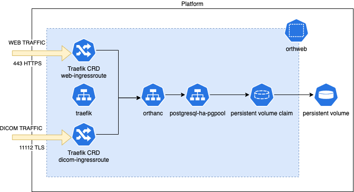

# Helm driven approach

In this approach, we deploy Orthanc with a single helm command, using our self-built Orthanc Helm Chart stored in the *orthanc* sub-directory. 

## Architecture
The *orthanc* Helm Chart automates many activities, including the creation of certificates for the three FQDNs, installation of PostgreSQL using dependency chart, configuring the orthanc workload, and setting up an ingress for HTTP and DICOM traffic. 

The Helm Chart dependency tree looks like this:

```bash
                     +--------------+
                     | Parent chart |
        +------------|   Orthanc    |-----------+
        |            --------+------+           |
        |                                       |
        v                                       v
+-------+-------+                       +--------+------+
|  Sub-chart    |                       |   Sub-chart   |
| PostgreSQL HA |                       |    Traefik    |
+---------------+                       +---------------+
```

Once the Parent chart has been deployed, the required kubernetes objects (including the ones from the sub-charts) are all deployed and it may take a minute for the Pods to come to READY states. Below is an illustration of Kubernetes objects:



## Preparation
Instead of publishing in a Helm Repository, the Orthanc Helm chart simply keeps the files in the local sub-directory *orthanc*. In order to deploy, we need to clone this repo first and enter the helm directory from command terminal:
```sh
$ git clone git@github.com:digihunch/korthweb.git
$ cd helm/
```
We also need to [install Helm](https://helm.sh/docs/intro/install/) client. The Helm client uses the kubectl's connection profile.


## Deployment

Since we're in the `helm` directory, we can update dependency and install the chart:
```sh
$ helm dependency update orthanc
$ helm install orthweb orthanc --create-namespace --namespace orthweb 
```
The installation should be completed once it prints the node. You can monitor the pod status in the *orthweb* namespace untill all pods are up and running.


## Troubleshooting
If you need to uninstall it and remove persistent data, simply run:
```sh
helm -n orthweb uninstall orthweb && kubectl -n orthweb delete pvc -l app.kubernetes.io/component=postgresql 
```
Then the uninstall is done and persistent volumes are removed.